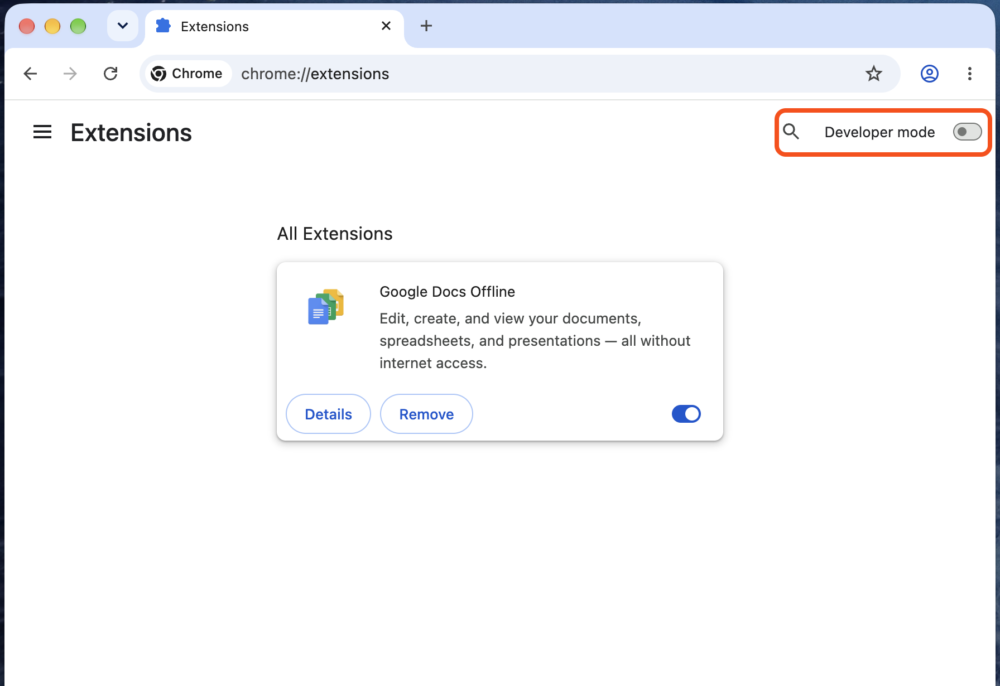
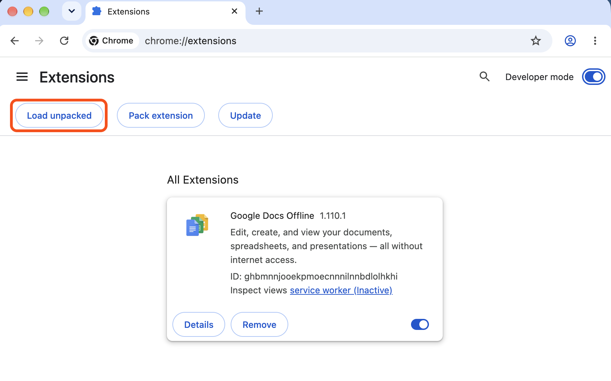
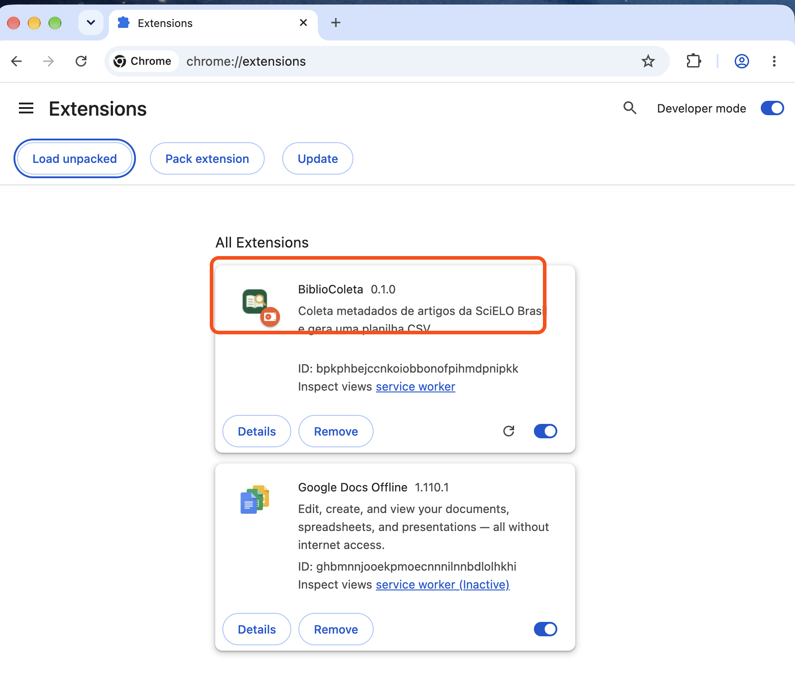
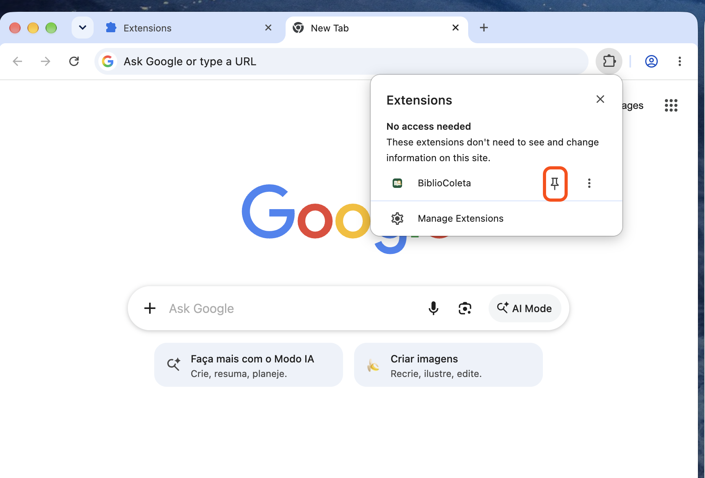
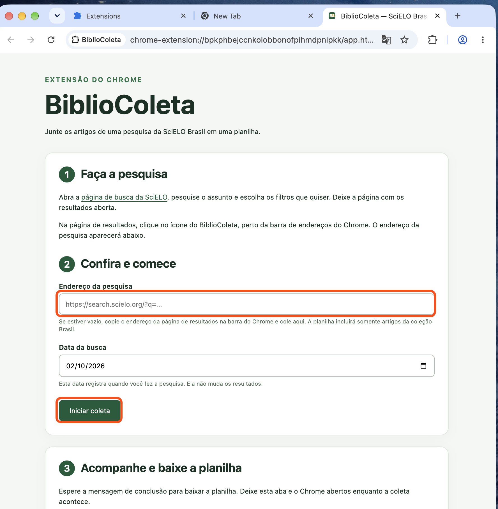

# Como instalar e usar o BiblioColeta no Chrome

O BiblioColeta transforma os resultados de uma pesquisa da **SciELO Brasil** em uma planilha. Você faz a pesquisa no site da SciELO; a extensão reúne os artigos. Não é preciso digitar comandos.

## Instalar a extensão

Esta é uma versão de teste, distribuída em um arquivo chamado `BiblioColeta-Chrome.zip`. Ela ainda não está na Chrome Web Store.

Nas fotos abaixo, o contorno laranja mostra onde você deve prestar atenção ou clicar.

1. Abra as [Releases do BiblioColeta](https://github.com/italopenaforte/BiblioColeta/releases), escolha **BiblioColeta para Chrome** e baixe **BiblioColeta-Chrome.zip** na seção **Assets**. Se recebeu o arquivo de quem organiza a pesquisa, use esse arquivo. Em geral, ele fica na pasta **Downloads**. Não escolha **Source code**.
2. Na pasta **Downloads**, clique no ZIP com o botão direito e escolha **Extrair Tudo…**. Isso criará uma pasta chamada **BiblioColeta-Chrome**. Guarde essa pasta em um lugar onde não será apagada: o Chrome precisa desses arquivos para a extensão continuar funcionando.
3. Abra o Chrome. Clique na barra onde você digita endereços, digite `chrome://extensions` e pressione **Enter**.

   

   *Foto 1 — Esta é a página que deve aparecer. Na captura, “Developer mode” significa “Modo do desenvolvedor”.*

4. Ligue **Modo do desenvolvedor**, no canto superior direito da página.
5. Clique em **Carregar sem compactação**. Na janela que abrir, entre em **Downloads** e selecione a pasta **BiblioColeta-Chrome** que você extraiu no passo 2. Clique em **Selecionar pasta**. A pasta correta contém o arquivo `manifest.json` diretamente dentro dela; não selecione o arquivo ZIP. Se você baixou o código completo do projeto em vez do ZIP da Release, selecione a pasta **extension** do projeto.

   

   *Foto 2 — Depois de ligar o botão no canto superior direito, aparece “Load unpacked”. Em português, esse botão é “Carregar sem compactação”.*

6. Procure o cartão **BiblioColeta** na página de extensões. Ele indica que a instalação terminou.

   

   *Foto 3 — O cartão com nome e ícone do BiblioColeta confirma que a extensão foi carregada. O número de identificação e outras extensões na sua tela podem ser diferentes.*

Para deixar o ícone à vista, clique no botão em forma de peça de quebra-cabeça perto da barra de endereços do Chrome e depois no alfinete ao lado de **BiblioColeta**.

*Foto 4 — Encontre “BiblioColeta” no menu e clique no alfinete à direita. Na captura, o menu aparece como “Extensions”.*

## Fazer uma coleta

1. Abra a [busca da SciELO](https://search.scielo.org/). Digite seu assunto, faça a pesquisa e escolha os filtros que desejar. Espere a página de resultados aparecer.
2. Ainda nessa página, clique no ícone **BiblioColeta** no Chrome. Uma nova aba se abrirá. Confira se o campo **Endereço da pesquisa** foi preenchido. Se estiver vazio, volte à página de resultados, copie o endereço que aparece na barra do Chrome e cole no campo.

   

   *Foto 5 — Confira o endereço no campo destacado. A foto mostra o campo vazio; nesse caso, copie o endereço da sua pesquisa na SciELO e cole ali. Depois, clique em “Iniciar coleta”, também destacado.*

3. Confira a **Data da busca** e clique em **Iniciar coleta**. Essa data serve para registrar quando você pesquisou; ela não filtra os artigos. A extensão considera somente a coleção Brasil.
4. Deixe o Chrome e a aba do BiblioColeta abertos. A extensão abrirá outra aba para ler os resultados e os artigos. A seção **Acompanhe e baixe a planilha** mostrará quantos artigos já foram guardados.
5. Quando aparecer **Coleta concluída. A planilha está pronta.**, clique em **Baixar planilha**.

O Chrome pode perguntar onde salvar. Escolha uma pasta que você conheça, como **Documentos**, e confirme. Se não perguntar, procure o arquivo na pasta **Downloads** do computador ou no histórico de downloads do Chrome (**Ctrl+J**). O arquivo se chama `artigos.csv` e fica dentro de uma pasta com o nome da pesquisa, em `BiblioColeta`.

**CSV** é uma planilha que pode ser aberta no Excel ou LibreOffice, ou importada no Google Planilhas. A planilha traz os links dos artigos e dos PDFs; ela não baixa os PDFs. O botão **Baixar resumo da pesquisa** salva um arquivo separado, `busca.json`, com a data, o endereço e os totais da coleta. Você não precisa desse arquivo para abrir a planilha.

## Se a coleta parar

- Se aparecer **Coleta pausada**, clique em **Retomar** para continuar. Os artigos já guardados permanecem neste perfil do Chrome.
- Se aparecer um erro temporário da SciELO, como **502**, a extensão tenta novamente duas vezes. Se ainda falhar, espere alguns minutos e clique em **Retomar**.
- Se a SciELO pedir uma verificação de acesso, olhe a aba da SciELO e siga as instruções mostradas por ela. A extensão não contorna bloqueios de acesso.
- Se precisar de ajuda, clique em **Copiar mensagem do erro** na página do BiblioColeta e cole a mensagem para quem está ajudando você. Não é preciso abrir o Console do Chrome.

Você pode clicar em **Baixar planilha** antes do fim para guardar uma cópia do que já foi coletado. Nesse caso, o nome terá `-parcial`. **Essa planilha está incompleta.** Quando a coleta terminar, baixe a planilha novamente.

O campo **Pesquisas guardadas neste Chrome** permite voltar a uma coleta anterior. Para apagar uma pesquisa e os artigos guardados no navegador, use **Apagar esta coleta do navegador** depois de baixar os arquivos que quer conservar.

## Atualizar a versão de teste

Substitua os arquivos da pasta extraída pela nova versão. Depois abra `chrome://extensions` e clique em **Atualizar** no cartão do BiblioColeta. Não remova a extensão antes de salvar as planilhas necessárias: remover a extensão pode apagar as coletas guardadas no Chrome.
