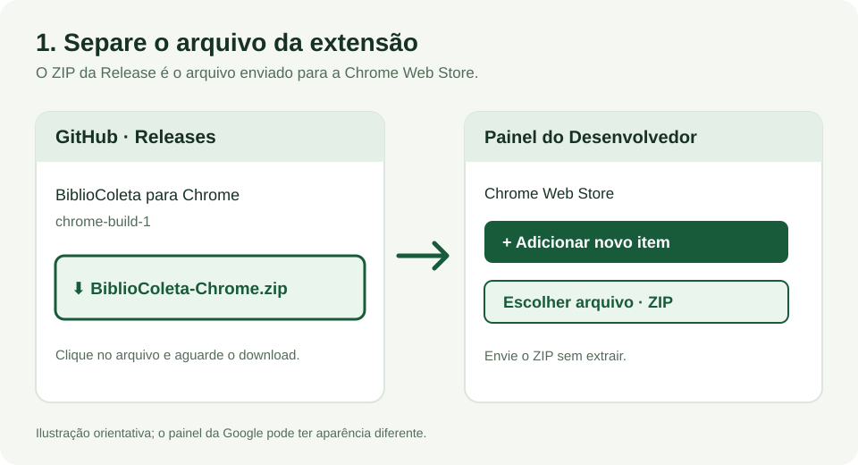
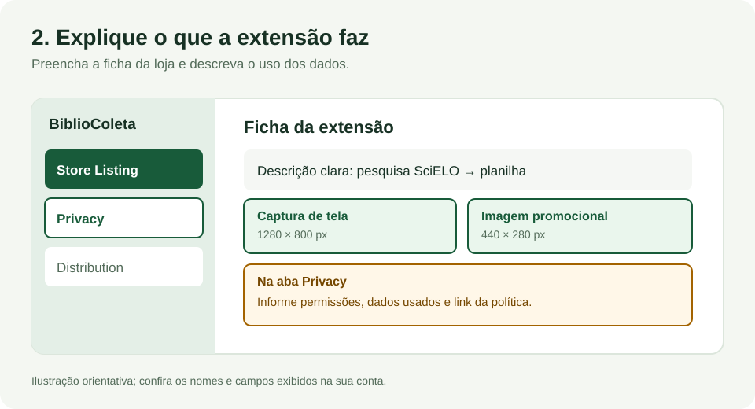
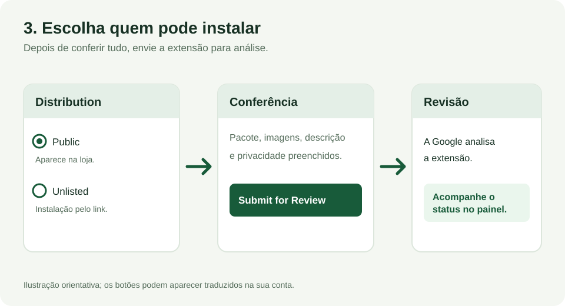

# Publicar o BiblioColeta na Chrome Web Store

Este guia é para quem vai publicar a extensão pela primeira vez. As imagens abaixo são **ilustrações orientativas**; a aparência do painel da Google pode mudar. Os nomes dos botões podem aparecer em português ou inglês.

## Antes de começar

- Use uma conta Google à qual você continuará tendo acesso. O [cadastro de desenvolvedor](https://developer.chrome.com/docs/webstore/register/) exige uma taxa única e a [verificação em duas etapas](https://developer.chrome.com/docs/webstore/program-policies/policies).
- Teste a extensão no Chrome com uma pesquisa real da SciELO, incluindo o download da planilha e a retomada de uma coleta interrompida. Veja o [estado da validação](VALIDACAO.md); ainda faltam testes reais documentados.
- Prepare **uma captura de tela real da extensão**, de preferência com 1280 × 800 pixels, e **uma imagem promocional de 440 × 280 pixels**. O ícone de 128 × 128 pixels já está no pacote. Veja os [requisitos de imagens da loja](https://developer.chrome.com/docs/webstore/images).

## 1. Baixe o pacote e envie ao painel

1. Abra as [Releases do BiblioColeta](https://github.com/italopenaforte/BiblioColeta/releases). Entre na versão mais recente chamada **BiblioColeta para Chrome** e baixe **BiblioColeta-Chrome.zip**.
2. Abra o [Painel do Desenvolvedor da Chrome Web Store](https://chrome.google.com/webstore/devconsole/) e entre com sua conta Google. No primeiro acesso, conclua o cadastro e pague a taxa mostrada pelo painel.
3. Clique em **Add new item** ou **Adicionar novo item**. Escolha `BiblioColeta-Chrome.zip` e envie. **Não extraia o ZIP** para essa etapa.

## 2. Preencha a ficha e a privacidade

1. Na aba **Store Listing** ou **Página da loja**, escreva uma descrição simples: o BiblioColeta lê os resultados de uma pesquisa feita na SciELO Brasil e gera uma planilha CSV. Informe o idioma português e envie a captura de tela e a imagem promocional preparadas antes.
2. Na aba **Privacy** ou **Privacidade**, descreva o propósito único da extensão e o uso dos dados. Ela lê páginas da SciELO, guarda a pesquisa e os artigos no próprio perfil do Chrome e salva CSV/JSON no destino escolhido pela pessoa. A extensão não envia esses dados a um servidor próprio.
3. Explique as permissões: `scripting` lê resultados e artigos da SciELO; `downloads` salva CSV e JSON; o acesso aos domínios `search.scielo.org` e `scielo.br` permite visitar essas páginas durante a coleta.
4. No campo da política de privacidade, use o endereço público da [política do BiblioColeta](https://github.com/italopenaforte/BiblioColeta/blob/main/docs/extension/PRIVACIDADE.md). Confira se as respostas no painel concordam com o texto da política e com o comportamento da extensão.

## 3. Escolha a distribuição e envie para revisão

1. Na aba **Distribution** ou **Distribuição**, escolha **Public** se quiser que qualquer pessoa encontre a extensão na loja. Escolha **Unlisted** se quiser compartilhar apenas o link de instalação. As duas opções passam por revisão.
2. Confira os campos e clique em **Submit for Review** ou **Enviar para revisão**. A Google analisará a extensão antes de disponibilizá-la. Acompanhe o estado no painel e no e-mail da conta de desenvolvedor.
3. Se quiser decidir a data de publicação depois da aprovação, desmarque a opção de publicação automática na confirmação do envio. Segundo a [documentação da Google](https://developer.chrome.com/docs/webstore/publish/), uma versão aprovada e mantida em espera precisa ser publicada em até 30 dias.

## Para atualizar depois

Altere a versão em [`extension/manifest.json`](../../extension/manifest.json), gere um novo ZIP e envie essa versão no mesmo item da loja. A versão precisa ser **maior que a anterior**. O merge na `main` publica o ZIP em uma Release do GitHub; o envio à Chrome Web Store é uma etapa separada. [Instruções oficiais para preparar o pacote](https://developer.chrome.com/docs/webstore/prepare/).
